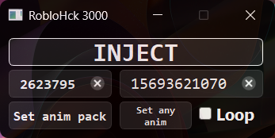

# Is this detected?
I think <mark>yes🙁</mark>
# How frequetly it updated?
In my plans <mark>its updating by itself</mark> because it fetches offsets from some api that works.
# WTF is this?
This is just animation changer that <mark>you can run everywhere</mark>
# Does everyone see these changes?
<mark>yes!</mark>

# How to use?
1. Launch Roblox app
2. Teleport into any game
3. Click inject in external
4. Change animation pack id, any animation id(not EMOTE id), loop tick, then click apply for needed changes
# How this is works?
1. Getting fake datamodel from pointer
2. From fake datamodel it gets real datamodel
3. From datamodel it gets workspace
4. From workspace it gets camera
5. From camera it gets humanoid
6. Now it has addresses for needed stuff
# Preview:

~~Un~~detected
***
[Quazonish](https://github.com/Quazonish/)